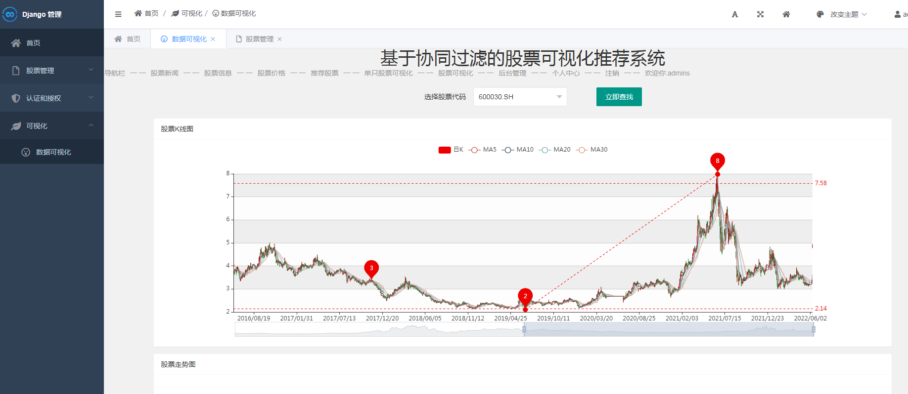

## 计算机毕业设计Python+Tensorflow股票推荐系统 股票预测系统 股票可视化 股票数据分析 量化交易系统 股票爬虫 股票K线图 大数据毕业设计 AI 人工智能 PyTorch 协同过滤算法 大数据毕业设计 电商推荐系统 商品价格预测 K-means聚类推荐算法 深度学习Kears 小说数据分析可视化 机器学习 Scrapy爬虫 协同过滤推荐算法 混合神经网络推荐算法 PySpark Hadoop Hive Hadoop PySpark 机器学习 深度学习 Python Scrapy分布式爬虫 机器学习 大数据毕业设计 数据仓库 大数据毕业设计 文本分类 LSTM情感分析 大数据毕业设计 知识图谱 大数据毕业设计 预测系统 实时计算 离线计算 数据仓库 人工智能 神经网络

## 要求
### 源码有偿！一套(论文 PPT 源码+sql脚本+教程)

### 
### 加好友前帮忙start一下，并备注github有偿纯python比价系统
### 我的QQ号是2827724252或者798059319或者 1679232425或者微信:bysj2023nb 或bysj1688

# 

### 加qq好友说明（被部分 网友整得心力交瘁）：
    1.加好友务必按照格式备注
    2.避免浪费各自的时间！
    3.当“客服”不容易，repo 主是体面人，不爆粗，性格好，文明人。
	
	
主要技术：Django框架、BeautifulSoup、协同过滤算法、爬虫爬取tushare接口股票新闻数据、17万数据、SQLite/mysql数据库

功能：
登录注册界面-个人信息修改-收藏、取消收藏-股票新闻爬取并且展示-数据展示-所有的股票可视化-单个证券具体展示(饼图、折线、柱状图、k线图等)-协同算法实现分类推荐

tushare接口是获取金融新闻数据的，该部分是运用爬虫来直接爬取数据的(爬虫亲测可用并且一直维护)。
因为股票网站的页面结构复杂，会被反爬，没有那么容易得到的，且数据比较敏感，所以数据是用之前存储的数据，如需更新数据，可自行到东方财富网--股票频道下载数据源。

演示视频
https://www.bilibili.com/video/BV1jJ4m1T7bz/?spm_id_from=333.999.0.0

